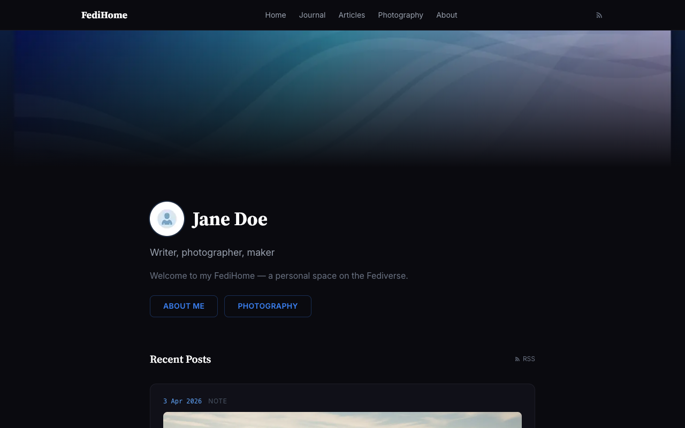
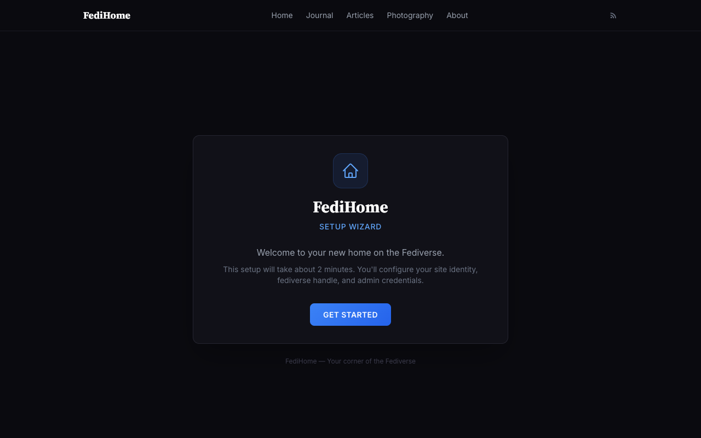
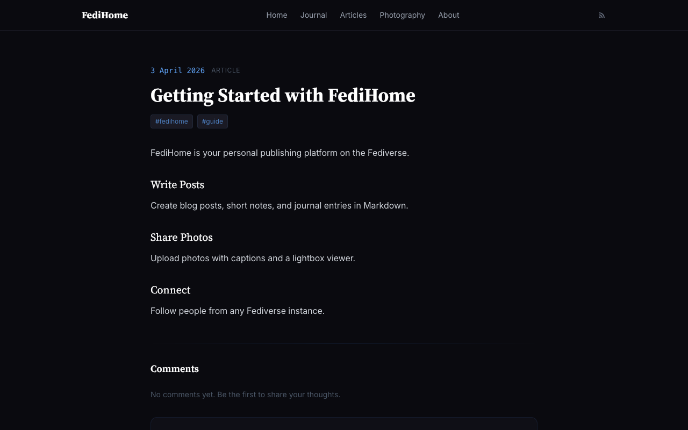
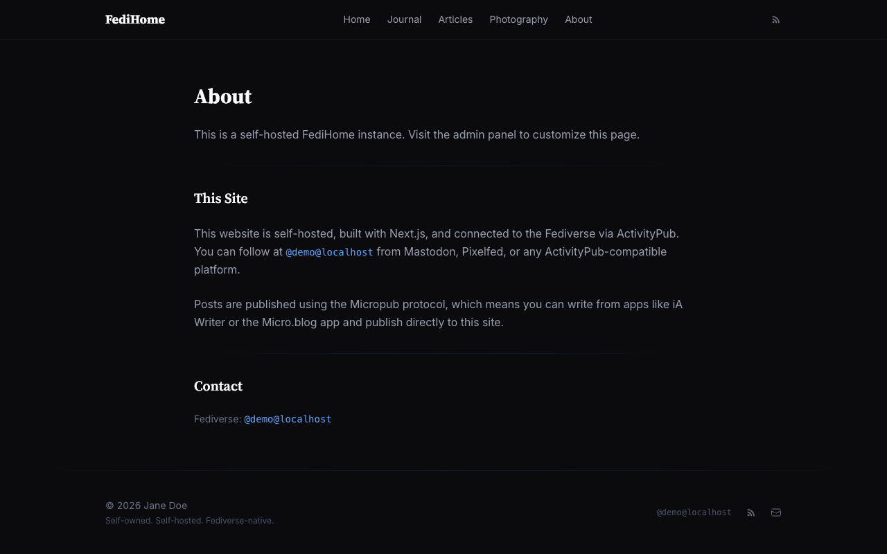

# FediHome 🏠

> Your home on the Fediverse. Blog, share photos, and connect — all from your own domain.

**🌐 See it live at [fedihome.social](https://fedihome.social)** — the demo runs FediHome itself. Follow the project at `@fedihome@fedihome.social`.



## What is FediHome?

FediHome is a self-hosted, single-user publishing platform that connects to the Fediverse via ActivityPub. Your domain becomes your identity — `@you@yourdomain.com`. No Mastodon instance, no WordPress, no Pixelfed — just one app that does it all.

## Features

**Publishing**
- Write blog posts, notes, and journal entries in Markdown
- Photo gallery with EXIF metadata and lightbox viewer
- RSS feed for subscribers
- Post from any Micropub-compatible app (iA Writer, micro.blog)

**Fediverse**
- Your domain IS your identity (`@you@yourdomain.com`)
- Follow and be followed from Mastodon, Pixelfed, Misskey, etc.
- Timeline of posts from people you follow
- Receive likes, boosts, replies, and DMs
- Reply to conversations from your admin panel

**Crossposting**
- Automatic crosspost to Bluesky
- MetaWeblog API support for legacy blog apps

**Simple Setup**
- One command to install
- Setup wizard configures everything
- Docker support (optional)

## Screenshots

| Setup Wizard | Article Post | About Page |
|:---:|:---:|:---:|
|  |  |  |

## Quick Start

### Option 1: AI-assisted install (recommended for non-technical users)

If you don't know how to code, the easiest way is to let an AI install it for you. Open [Claude Code](https://claude.com/claude-code) in an empty folder and paste the prompt from [docs/install-with-ai.md](docs/install-with-ai.md). It'll install Node.js and PostgreSQL if you don't have them, create a database, set up your secrets, and walk you through the setup wizard — answering any questions in plain English.

### Option 2: Script install
```bash
curl -sSL https://raw.githubusercontent.com/TemujinCalidius/fedihome/main/install.sh | bash
```

The installer will offer to install PostgreSQL for you if it's missing, auto-create a local database, generate your admin secret, and build the app. Then visit `http://localhost:3000/setup` to configure your instance via the setup wizard.

### Option 3: Manual install
```bash
git clone https://github.com/TemujinCalidius/fedihome.git
cd fedihome
npm install
cp .env.example .env.local
# Edit .env.local with your database URL
npx prisma db push
npm run build
npm start
```

### Option 4: Docker
```bash
git clone https://github.com/TemujinCalidius/fedihome.git
cd fedihome
cp .env.example .env.local
docker compose up -d
```

## Requirements
- Node.js 20+ (or Docker)
- PostgreSQL 15+ (the installer can set this up for you)
- A domain name with DNS access (only needed when you go public)

## Videos and Audio

FediHome supports two new attachment types alongside photos:

- **Videos** — paste a PeerTube URL in compose (allowlist in `src/lib/peertube.ts`; defaults include MakerTube, Framatube, TilVids, and a handful of other trusted instances). The system fetches title and thumbnail via PeerTube oEmbed and embeds the video on the post. Listing at `/videos`. Add custom hosts by editing `ALLOWED_HOSTS`.
- **Audio** — upload MP3s up to 100MB. Native HTML5 player on post pages, listing at `/audio`, and a podcast RSS feed at `/audio/feed.xml`. Configure podcast metadata via env vars: `PODCAST_TITLE`, `PODCAST_AUTHOR`, `PODCAST_DESCRIPTION`, `PODCAST_EMAIL`, `PODCAST_IMAGE`.

Both render natively as ActivityPub attachments — Mastodon, Pleroma, and Misskey will show the audio player or video link preview.

## Updating

To update to the latest version:

```bash
cd /path/to/fedihome
npm run update
```

This runs `update.sh`, which fetches new code, shows you what's new, asks for confirmation, installs dependencies, applies any schema changes (Prisma refuses if data would be lost), rebuilds, and restarts the server (pm2 / systemd / docker compose — whichever it finds).

Want passive notifications when there's a new version? Run `npm run check-updates` and a "FediHome update available" item will appear in your admin notification bell whenever upstream `main` is ahead of your checkout. The same command also scans for outdated dependencies, security advisories, and new releases of key libraries (Fedify, Next.js, Prisma, atproto, React).

```bash
npm run check-updates
```

Schedule it weekly via cron:

```cron
0 9 * * 1 cd /path/to/fedihome && /usr/local/bin/npm run check-updates >> /tmp/fedihome-updates.log 2>&1
```

Backfill photo dimensions (one-off, after upgrading from <0.1.8) — required for the masonry layout to render without column collapse:

```bash
npm run backfill-photo-dimensions
```

## Documentation
- [Install with AI](docs/install-with-ai.md) — Non-technical install using Claude Code
- [Getting Started](docs/getting-started.md) — First 10 minutes
- [Configuration](docs/configuration.md) — All settings explained
- [Deployment](docs/deployment.md) — Production setup with Cloudflare/VPS/Docker
- [Cloudflare Tunnel](docs/cloudflare-tunnel.md) — Secure home server hosting
- [Fediverse Setup](docs/fediverse-setup.md) — How federation works
- [Bluesky Integration](docs/bluesky-integration.md) — Crossposting setup
- [Micropub](docs/micropub.md) — Post from third-party apps
- [Theming](docs/theming.md) — Customize your site's look
- [Architecture](docs/architecture.md) — Codebase overview

## Tech Stack
- **Framework:** Next.js 16 + React 19
- **Language:** TypeScript
- **Database:** PostgreSQL via Prisma
- **Styling:** Tailwind CSS
- **Federation:** ActivityPub + HTTP Signatures
- **Crossposting:** AT Protocol (Bluesky)

## Support

FediHome is free, open-source, and built in the open. If it's useful to you and you'd like to help fund its development, you can sponsor the project on GitHub:

**[💖 Sponsor FediHome on GitHub →](https://github.com/sponsors/TemujinCalidius)**

Every bit helps keep the project maintained and improving — thank you!

## Contributing
See [CONTRIBUTING.md](CONTRIBUTING.md).

## License
MIT

---

Built with code and AI. FediHome believes the web should be personal, federated, and yours.
